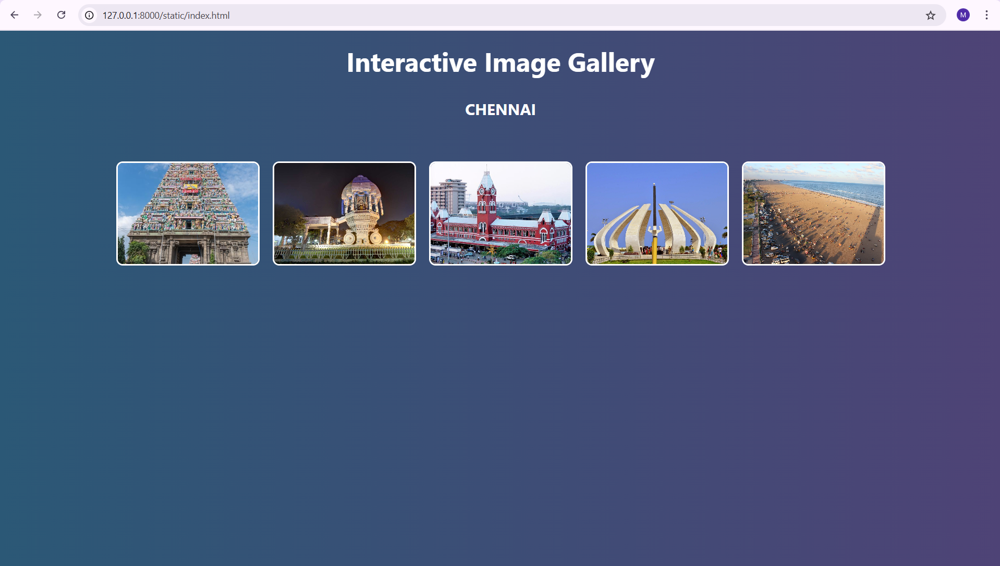
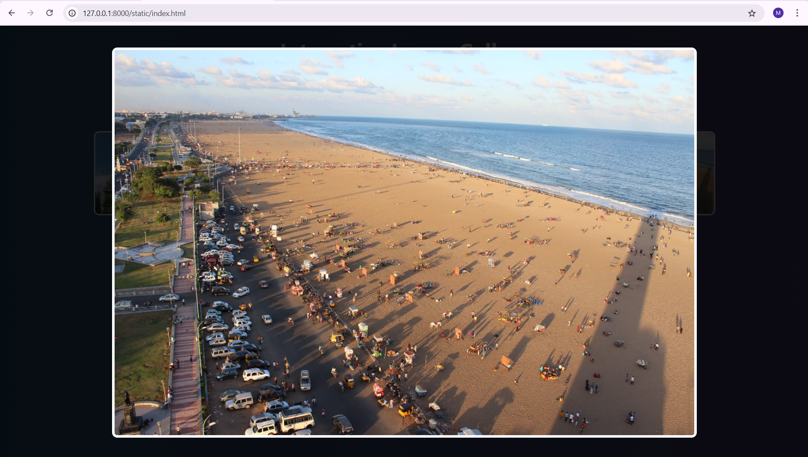

# Ex.08 Design of Interactive Image Gallery
# REG NO :212224040196
# DATE : 21-05-2025

## AIM
  To design a web application for an inteactive image gallery with minimum five images.

## DESIGN STEPS

## Step 1:

Clone the github repository and create Django admin interface

## Step 2:

Change settings.py file to allow request from all hosts.

## Step 3:

Use CSS for positioning and styling.

## Step 4:

Write JavaScript program for implementing interactivit

## Step 5:

Validate the HTML and CSS code

## Step 6:

Publish the website in the given URL.

## PROGRAM

index.html
```html
<!DOCTYPE html>
<html lang="en">
<head>
  <meta charset="UTF-8" />
  <meta name="viewport" content="width=device-width, initial-scale=1.0"/>
  <title>Interactive Image Gallery</title>
  <link rel="stylesheet" href="style.css" />
</head>
<body>
  <div class="container">
    <h1>Interactive Image Gallery</h1>
    <h2>CHENNAI</h2>
    <br>
    <br>
    <br>
    <div class="gallery">
      
      
      
      
      
    </div>
  </div>

  <div id="popup" class="popup" onclick="hideImage()">
    
  </div>

  <script src="script.js"></script>
</body>
</html>
```

style.css
```css
* {
  margin: 0;
  padding: 0;
  box-sizing: border-box;
}

body, html {
  height: 100%;
  width: 100%;
  font-family: 'Segoe UI', Tahoma, Geneva, Verdana, sans-serif;
  background: linear-gradient(to right, #2b5876, #4e4376); /* Beautiful gradient background */
  color: white;
}

.container {
  min-height: 100vh;
  padding: 20px;
  display: flex;
  flex-direction: column;
  align-items: center;
}

h1 {
  margin-bottom: 30px;
  font-size: 2.5rem;
}

.gallery {
  display: flex;
  flex-wrap: wrap;
  gap: 20px;
  justify-content: center;
  width: 100%;
  max-width: 1200px;
}

.gallery img {
  width: 220px;
  height: 160px;
  object-fit: cover;
  border: 3px solid #fff;
  border-radius: 10px;
  cursor: pointer;
  transition: transform 0.3s, border-color 0.3s;
}

.gallery img:hover {
  transform: scale(1.05);
  border-color: #ffcc00;
}

.popup {
  position: fixed;
  top: 0;
  left: 0;
  height: 100%;
  width: 100%;
  background-color: rgba(0, 0, 0, 0.85);
  display: none;
  justify-content: center;
  align-items: center;
  z-index: 10;
}

.popup img {
  max-width: 90%;
  max-height: 90%;
  border: 5px solid white;
  border-radius: 10px;
}
```

script.js
```js
function showImage(element) {
  var popup = document.getElementById("popup");
  var popupImg = document.getElementById("popup-img");
  popupImg.src = element.src;
  popup.style.display = "flex";
}

function hideImage() {
  document.getElementById("popup").style.display = "none";
}
```


## OUTPUT





## RESULT
  The program for designing an interactive image gallery using HTML, CSS and JavaScript is executed successfully.
